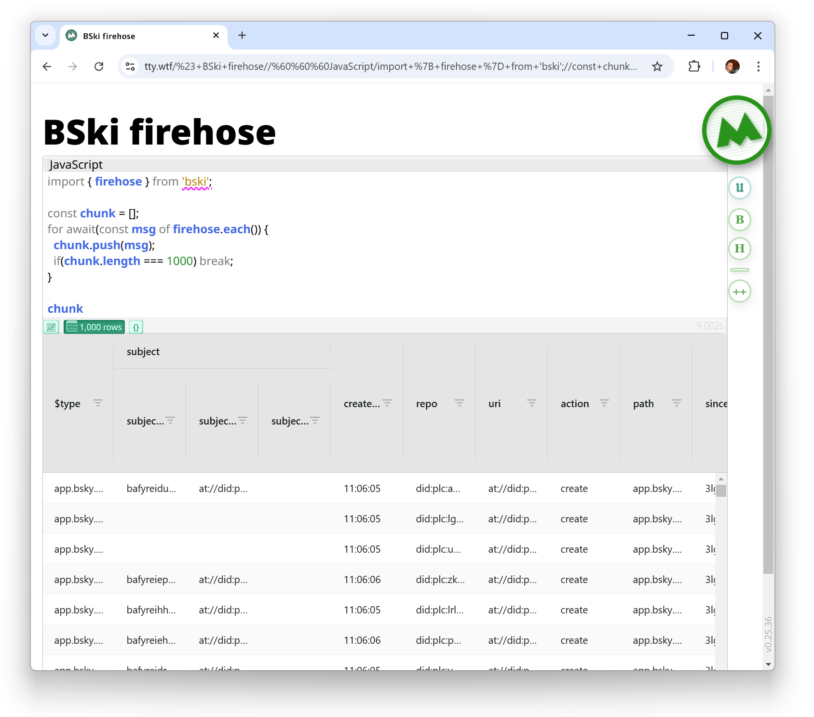
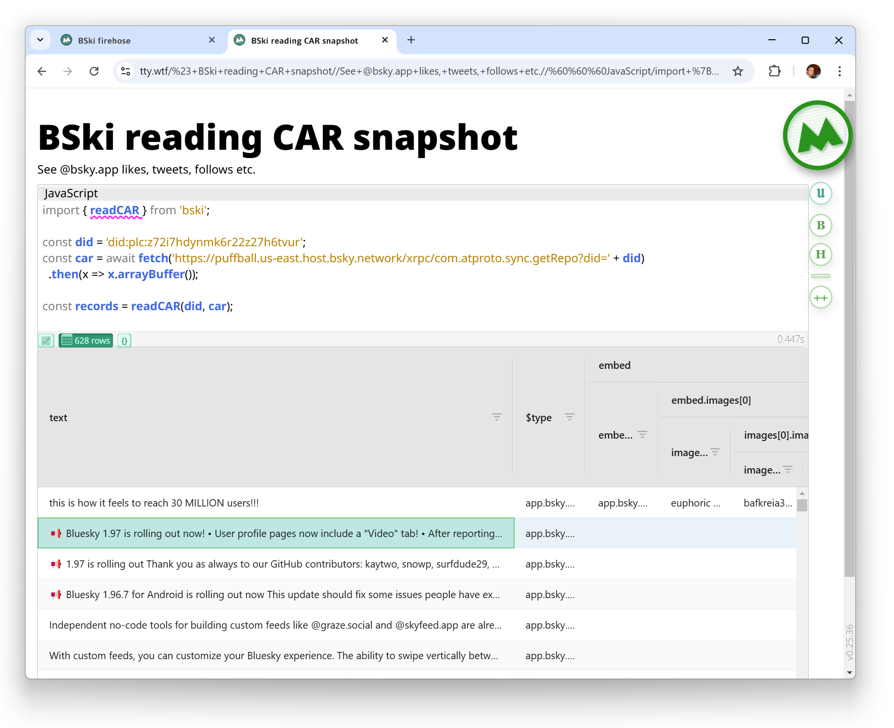

# Bski raw CAR/CBOR format parsing

Parsing raw binary content of the realtime **firehose** from WebSocket, and **CAR** account repository snapshot data.

Self-contained, zero dependencies.

## Installation

```
npm install bski
```

## Reading firehose

```JavaScript
import { firehose } from 'bski'; // import from npm

const chunk = [];
for await(const msg of firehose.each()) {
  chunk.push(msg);
  if(chunk.length === 1000) break;
}
```

[  ](https://tty.wtf/%23+BSki+firehose//%60%60%60JavaScript/import+%7B+firehose+%7D+from+'bski';//const+chunk+=+%5B%5D;/for+await(const+msg+of+firehose.each())+%7B/++chunk.push(msg);/++if(chunk.length+===+1000)+break;/%7D//chunk/%60%60%60//)

## Reading CAR

```JavaScript
import { readCAR } from 'bski'; // import from npm

const did = 'did:plc:z72i7hdynmk6r22z27h6tvur';
const car = await fetch('https://puffball.us-east.host.bsky.network/xrpc/com.atproto.sync.getRepo?did=' + did)
  .then(x => x.arrayBuffer());

const records = readCAR(did, car);
```

[  ](https://tty.wtf/%23+BSki+reading+CAR+snapshot//See+@bsky.app+likes,+tweets,+follows+etc.//%60%60%60JavaScript/import+%7B+readCAR+%7D+from+'bski';//const+did+=+'did:plc:z72i7hdynmk6r22z27h6tvur';/const+car+=+await+fetch('https:%2F%2Fpuffball.us-east.host.bsky.network%2Fxrpc%2Fcom.atproto.sync.getRepo%3Fdid='+%2B+did)/++.then(x+=%3E+x.arrayBuffer());//const+records+=+readCAR(did,+car);//%60%60%60//)

## History and references

The firehose functionality existed in [colds.ky](https://colds.ky) codebase for a while,
using some of the packages referenced by the official [@atproto/api](https://www.npmjs.com/package/@atproto/api).

* [@ipld/car](https://github.com/ipld/js-car) - Apache 2.0 and MIT
* [cbor-x](https://github.dev/kriszyp/cbor-x) - MIT
* [multiformats](https://github.com/multiformats/js-multiformats) - Apache 2.0 and MIT
* [cborg](github.com/rvagg/cborg) - Apache 2.0
* [@ipld/dag-cbor](https://github.com/ipld/js-dag-cbor) - Apache 2.0 and MIT
* [varint](https://github.com/chrisdickinson/varint) - MIT

But those are pretty complex and convoluted libraries, even doing JavaScript codegeneration at some point.

The goal of this library is to take in any necessary bits, remove generalist complexity
and focus on singular use case: parsing realtime firehose, and account repository CAR.

These use variations of the same binary format, and polishing and optimising this code
hopefully will provide a strong basis to browser-based tools in the `AT`mosphere.

# License and links

[MIT](LICENSE) Oleg Mihailik

* [GitHub](https://github.com/colds-ky/bski)
* [npm](https://www.npmjs.com/package/bski)
* [@oyin.bo](https://bsky.app/profile/oyin.bo)